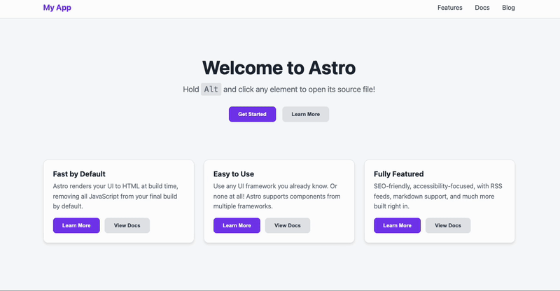

# astro-click-to-source

[](https://www.npmjs.com/package/astro-click-to-source)
[](https://opensource.org/licenses/MIT)



An Astro integration that enables click-to-source functionality during development. Hold Alt (or another modifier) and click any element to instantly open its source file in your editor at the exact line and column.

## Features

- **Alt+Click to open source** - Jump directly to the component source in your editor
- **Visual highlighting** - See which element you're about to open when holding the modifier key
- **Tooltip preview** - Shows the file path and line number before you click
- **Clipboard mode** - Copy the source path instead of opening the editor
- **Multi-editor support** - Works with VS Code, Neovim, WebStorm, and more
- **HMR-aware** - Maintains source mappings across hot module reloads
- **Zero config** - Works out of the box with sensible defaults

## Installation

```bash
npm install astro-click-to-source
```

## Usage

Add the integration to your `astro.config.mjs`:

```javascript
import { defineConfig } from 'astro/config';
import { clickToSource } from 'astro-click-to-source';

export default defineConfig({
  integrations: [clickToSource()]
});
```

Then run your dev server and **Alt+Click** (or **Option+Click** on Mac) any element to open its source file.

## Options

| Option | Type | Default | Description |
|--------|------|---------|-------------|
| `modifier` | `'alt' \| 'ctrl' \| 'meta' \| 'shift'` | `'alt'` | Modifier key to hold while clicking |
| `showHighlight` | `boolean` | `true` | Show visual highlight on hover when modifier is held |
| `annotate` | `boolean` | _auto_ | Inject `data-astro-source-*` attributes ourselves instead of relying on Astro's compiler. Auto-enabled on Astro 7+ (see [Compatibility](#compatibility)). Leave unset unless you need to force it on or off. |

### Example with options

```javascript
import { clickToSource } from 'astro-click-to-source';

export default defineConfig({
  integrations: [
    clickToSource({
      modifier: 'ctrl',      // Use Ctrl+Click instead of Alt+Click
      showHighlight: false   // Disable visual highlighting
    })
  ]
});
```

## Environment Variables

### `CLICK_TO_SOURCE`

Set this environment variable to customize the behavior:

| Value | Behavior |
|-------|----------|
| `code` (default) | Open in VS Code |
| `cursor` | Open in Cursor |
| `windsurf` | Open in Windsurf |
| `antigravity` | Open in Antigravity |
| `trae` | Open in Trae |
| `nvim` | Open in Neovim |
| `vim` | Open in Vim |
| `webstorm` | Open in WebStorm |
| `phpstorm` | Open in PhpStorm |
| `idea` | Open in IntelliJ IDEA |
| `sublime` | Open in Sublime Text |
| `atom` | Open in Atom |
| `clipboard` | Copy path to clipboard instead of opening editor |

> Any CLI command on your `PATH` that accepts a `file:line:column` argument will work — the value is forwarded to [`launch-editor`](https://github.com/yyx990803/launch-editor). So if your editor ships a shell binary (e.g. the `antigravity` command installed by the Antigravity IDE), just set `CLICK_TO_SOURCE` to its name.

```bash
# Open in Neovim
CLICK_TO_SOURCE=nvim npm run dev

# Open in Antigravity IDE
CLICK_TO_SOURCE=antigravity npm run dev

# Copy to clipboard
CLICK_TO_SOURCE=clipboard npm run dev
```

## How It Works

1. **Source Mapping**: Elements carry `data-astro-source-file` and `data-astro-source-loc` attributes in development mode. On Astro 4–6 these come from Astro's compiler; on Astro 7+ this integration injects them itself (see [Compatibility](#compatibility))
2. **Caching**: The integration caches these mappings to survive HMR updates
3. **Click Handling**: When you Alt+Click, it finds the nearest element with source info
4. **Editor Opening**: Uses [`launch-editor`](https://github.com/yyx990803/launch-editor) to open your editor at the exact location

## Compatibility

Click-to-source relies on each element carrying a `data-astro-source-file` /
`data-astro-source-loc` attribute that points back at its position in the
`.astro` source.

- **Astro 4–6** emit these attributes from the compiler (`@astrojs/compiler`,
  Go/WASM), so the integration just reads them.
- **Astro 7** replaced that compiler with the Rust `@astrojs/compiler-rs`,
  which no longer emits the attributes — so without this integration the
  feature silently stops working. To fix it, the integration adds a dev-only
  Vite `load` hook that parses each `.astro` file with the standalone
  `@astrojs/compiler` and injects the attributes back into the template before
  Astro compiles it. This is auto-enabled on Astro 7+ and runs only in `astro
  dev` (production output is untouched).

You can override the auto-detection with the [`annotate`](#options) option.

## Editor Detection

The integration uses `launch-editor` which automatically detects your editor from:

1. `CLICK_TO_SOURCE` environment variable
2. `LAUNCH_EDITOR` environment variable
3. `EDITOR` environment variable
4. Running editor processes

## Requirements

- Astro 4, 5, 6, or 7
- Node.js 18.17.0 or higher (Astro 7 / Vite 8 require Node.js 20.19.0+)

## License

MIT
